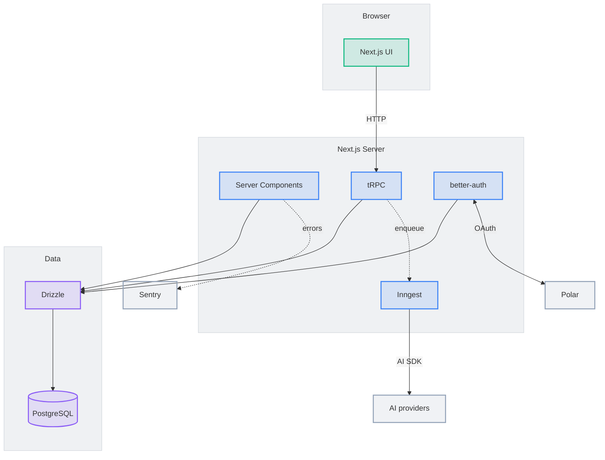
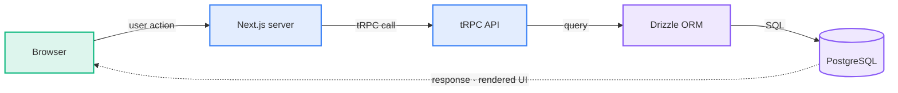
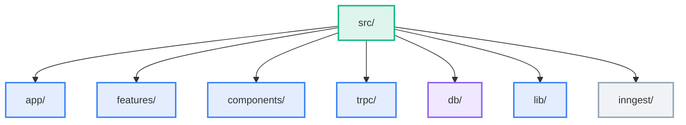

# Architecture Diagram Generator

Generate professional **Mermaid** diagrams embedded directly in `README.md`. GitHub
renders Mermaid inline — **no image files, no export step**. Claude writes a short
declarative graph; Mermaid handles layout.

## Arguments

- `/arch-diagram all` — all 3 diagrams (default if no arg)
- `/arch-diagram structure` · `dataflow` · `architecture` — one only

---

## Step 1: Discover

```bash
find . -maxdepth 3 -type d -not -path '*/node_modules/*' -not -path '*/.git/*' -not -path '*/.next/*' | sort
cat package.json 2>/dev/null | head -30
```

Also read `CLAUDE.md` and the DB schema. Diagram what exists — never invent components.

---

## Step 2: Style (light/dark adaptive)

The diagrams must look good in **both** GitHub light and dark mode. The trick:
**do NOT set a `theme` or hardcode background/fill colors** — let GitHub pick its
light/dark base (which also supplies a matching, line-masking edge-label background).
Convey layers with **vivid borders + translucent fills** (8-digit hex with low alpha),
which read well on any background while the theme keeps text readable.

Init directive (flowchart config + minimal theme vars, NO `theme`, NO `background`):

```
%%{init: {'flowchart':{'htmlLabels':false,'padding':16,'nodeSpacing':65,'rankSpacing':95,'curve':'basis','subGraphTitleMargin':{'top':14,'bottom':8}},'themeVariables':{'fontSize':'15px','clusterBkg':'#64748b1a','clusterBorder':'#64748b40'}}}%%
```

Layer classes (border + ~14%-alpha fill; mid-tone colors visible on light AND dark):

```
classDef accent   stroke:#10b981,stroke-width:2px,fill:#10b98124
classDef app      stroke:#3b82f6,stroke-width:2px,fill:#3b82f624
classDef data     stroke:#8b5cf6,stroke-width:2px,fill:#8b5cf624
classDef external stroke:#94a3b8,stroke-width:2px,fill:#94a3b824
```

Palette intent: **emerald** = entry/user-facing, **blue** = app/server, **violet** =
data, **slate** = third-party.

### Non-negotiable rules

1. **`htmlLabels:false` and NO custom `fontFamily`** — Mermaid must measure and render
   in the same font, or labels clip. (8-digit hex fills require `htmlLabels:false`.)
2. **No `theme`, no `background`, no node `fill:`/`color:` solids** — anything opaque
   breaks light/dark adaptivity. Use translucent fills + the theme's own text colour.
3. **Avoid arrows crossing labels.** Prefer one labelled edge between layers over a fan
   of several (e.g. `UI -->|HTTP| TRPC`, not three arrows from `UI`). The theme's
   edge-label background masks an edge's *own* line; it can't mask *other* arrows that
   happen to cross the label — so don't create those crossings.
4. **Short node labels** (one or two words); push detail to edge labels.
5. One direction per diagram; group with `subgraph`; keep externals as free nodes.

---

## Step 3: Author the diagram(s)

### Architecture — `flowchart TB`, layered subgraphs + free external nodes



### Data flow — `flowchart LR` summary (NOT a step-by-step sequence)

A left-to-right pipeline with one dotted response arc back.



### Folder structure — `flowchart TB` tree, short labels



---

## Step 4: Write into README.md

In the `## Architecture` section, replace any old image refs or prior Mermaid blocks
with the new blocks under `### System architecture`, `### Data flow`,
`### Folder structure`. Keep the note: `Diagrams are Mermaid — they render inline on
GitHub and adapt to light/dark. Run /arch-diagram to refresh.`

## Step 5: Drift check (skip if unchanged)

Read the existing ` ```mermaid ` blocks; if the current `src/` dirs / data hops /
component layers are already represented, print `<diagram> is up to date — skipping`.

## Step 6: Summary

Report which diagrams generated/skipped and any part of the stack you couldn't map.
