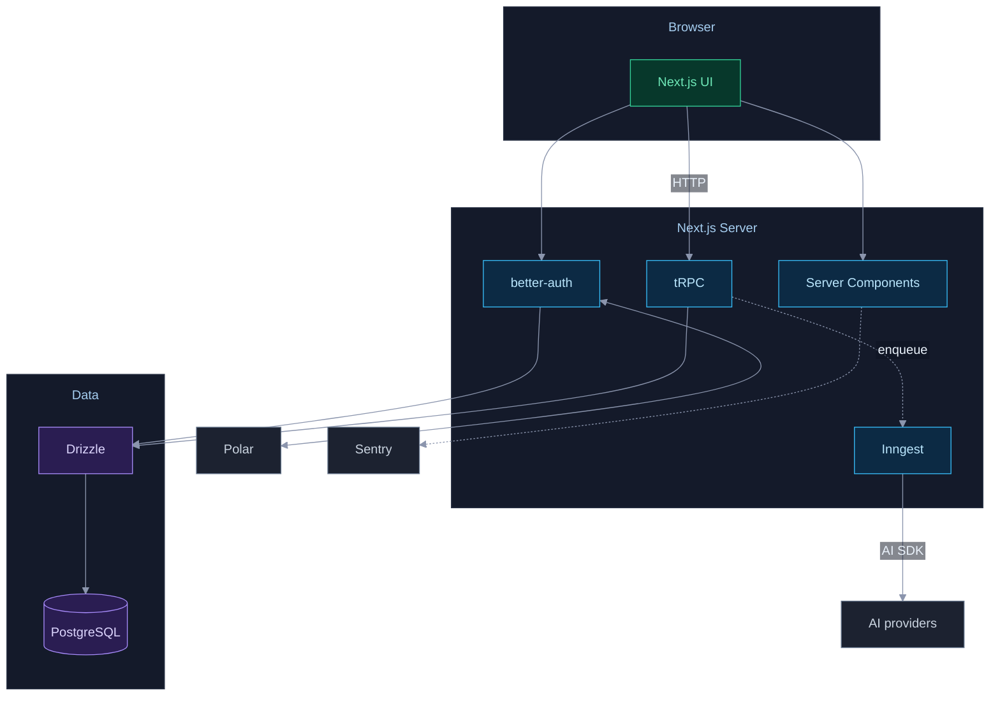
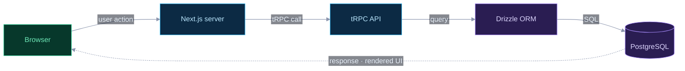
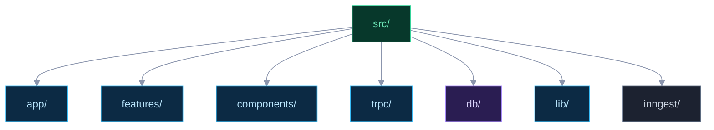

# Architecture Diagram Generator

Generate professional **Mermaid** diagrams embedded directly in `README.md`. GitHub
renders Mermaid inline — there are **no image files and no export step**. Claude writes
a short declarative graph; Mermaid handles layout.

## Arguments

- `/arch-diagram all` — all 3 diagrams (default if no arg)
- `/arch-diagram structure` — folder structure only
- `/arch-diagram dataflow` — data flow only
- `/arch-diagram architecture` — system architecture only

---

## Step 1: Discover

```bash
find . -maxdepth 3 -type d \
  -not -path '*/node_modules/*' -not -path '*/.git/*' \
  -not -path '*/dist/*' -not -path '*/.next/*' | sort
cat package.json 2>/dev/null | head -30
```

Also read `CLAUDE.md` and `src/db/schema.ts` (or the project's schema) to ground the
diagrams in the real stack. Never invent components — diagram what exists.

---

## Step 2: Theme (prepend to EVERY diagram)

A **dark, high-contrast** theme. Prepend this init directive to each diagram so all
three share one look. For flowcharts include the `flowchart` config shown; for the
data-flow flowchart it is the same.

```
%%{init: {'flowchart':{'htmlLabels':false,'padding':16,'nodeSpacing':55,'rankSpacing':80,'curve':'basis','subGraphTitleMargin':{'top':14,'bottom':8}},'theme':'base','themeVariables':{'darkMode':true,'background':'#0d1220','fontSize':'15px','primaryColor':'#0c2a44','primaryBorderColor':'#38bdf8','primaryTextColor':'#eaf2fb','lineColor':'#8b95ad','clusterBkg':'#141a2a','clusterBorder':'#2a3346','clusterTextColor':'#c3ccdc','edgeLabelBackground':'#0d1220'}}}%%
```

Layer classes (define once per flowchart, apply with `class <nodes> <layer>`):

```
classDef accent   fill:#07382b,stroke:#34d399,color:#6ee7b7
classDef app      fill:#0c2a44,stroke:#38bdf8,color:#bae6fd
classDef data     fill:#2a1d52,stroke:#a78bfa,color:#ddd6fe
classDef external fill:#1c2230,stroke:#64748b,color:#cbd5e1
```

Palette intent: **emerald** = entry/user-facing, **sky** = your app/server code,
**violet** = data layer, **slate** = third-party/external services.

### Non-negotiable rules (these prevent the two failure modes we hit)

1. **`htmlLabels:false` AND no custom `fontFamily`.** Mermaid must measure and render
   text in the *same* font; a custom font makes it measure narrower than it renders,
   which clips every label. Use the default font.
2. **Short node labels** — one or two words. Push detail to edge labels (`A -->|label| B`)
   or drop it. Long labels are the other clipping cause.
3. **Top-to-bottom or left-to-right flow**, one consistent direction per diagram.
4. Group with `subgraph`; place loosely-coupled externals as **free nodes** (no
   subgraph) so Mermaid routes their edges cleanly instead of through a cluster wall.

---

## Step 3: Author the diagram(s)

### Architecture — `flowchart TB`, layered subgraphs + free external nodes



### Data flow — `flowchart LR` summary (NOT a step-by-step sequence)

A left-to-right pipeline of where data goes, with one dotted **response arc** back.



### Folder structure — `flowchart TB` tree, short labels



---

## Step 4: Write into README.md

Find the `## Architecture` section. Replace any diagram references (old ``
images or prior Mermaid blocks) with the freshly authored Mermaid blocks under short
sub-headings: `### System architecture`, `### Data flow`, `### Folder structure`.
Only replace blocks for diagrams generated this run. Keep the one-line note:
`Diagrams are Mermaid — they render inline on GitHub. Run /arch-diagram to refresh.`

---

## Step 5: Drift check (skip if unchanged)

Before regenerating, read the existing ` ```mermaid ` block(s) in `README.md`. If every
current top-level `src/` dir (structure), data-layer hop (dataflow), or component layer
(architecture) is already represented, print `<diagram> is up to date — skipping` and
stop for that diagram. Otherwise regenerate it.

---

## Step 6: Summary

Report: which diagrams generated/skipped, and any part of the stack you couldn't map
(so the user can confirm).
