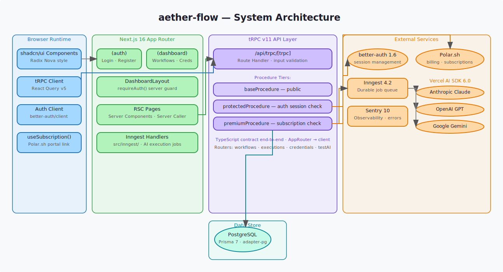
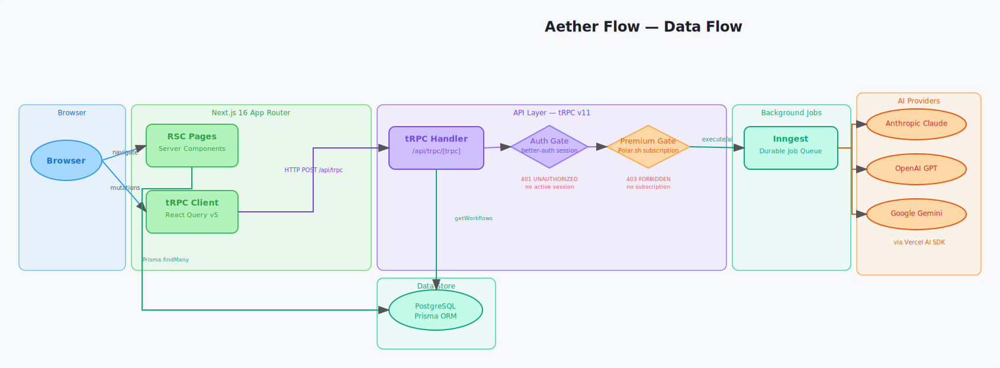
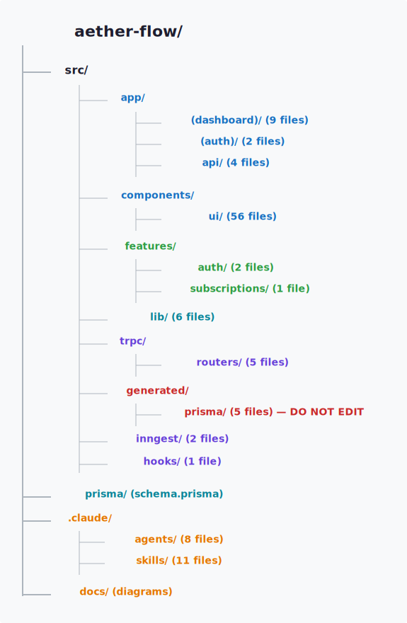

# aether-flow

AI-powered workflow automation platform — build, run, and observe multi-step AI workflows across multiple providers.

[Architecture](docs/diagrams/architecture.svg)

---

## Overview

Aether Flow is an early-stage workflow automation platform where users compose and execute multi-step AI jobs across Google, OpenAI, and Anthropic. Auth and workflow state are persisted in PostgreSQL via Prisma. Long-running AI executions are offloaded to Inngest background jobs, keeping the HTTP layer fast and giving each run full observability and retry support. The API surface is fully typed end-to-end via tRPC v11. Subscriptions and billing are handled by Polar.

**Stack:** Next.js 16 · React 19 · TypeScript · tRPC v11 · Prisma 7 · better-auth · Polar · Inngest · Tailwind CSS v4 · shadcn/ui

---

## Getting started

```bash
bun install
bun dev
```

Open [http://localhost:3000](http://localhost:3000) in your browser.

| Command | Description |
|---------|-------------|
| `bun dev` | Start the development server |
| `bun build` | Production build |
| `bun start` | Start the production server |
| `bun lint` | Lint with oxlint |
| `bun lint:fix` | Auto-fix lint errors |
| `bun format` | Format all files with oxfmt |
| `bun format:check` | Check formatting without writing |
| `bun --bun run prisma generate` | Regenerate Prisma client |
| `bun --bun run prisma migrate dev` | Run database migrations |
| `bun inngest:dev` | Start Inngest dev server |

---

## Architecture

Aether Flow is a Next.js 16 App Router application organised into three layers: route-level page shells in `src/app/`, feature modules in `src/features/`, and shared primitives in `src/components/`, `src/hooks/`, and `src/lib/`. The backend API is tRPC v11 served at `/api/trpc`, with auth at `/api/auth` (better-auth) and background jobs at `/api/inngest` (Inngest).



### Pages

| Route | File | Description |
|-------|------|-------------|
| `/` | `src/app/page.tsx` | Landing / marketing page |
| `/login` | `src/app/(auth)/login/page.tsx` | Login form |
| `/signup` | `src/app/(auth)/signup/page.tsx` | Registration form |
| `/workflows` | `src/app/(dashboard)/(rest)/workflows/page.tsx` | Workflow list |
| `/workflows/[workflowId]` | `src/app/(dashboard)/(editor)/workflows/[workflowId]/page.tsx` | Workflow canvas editor |
| `/executions` | `src/app/(dashboard)/(rest)/executions/page.tsx` | Execution history |
| `/executions/[executionId]` | `src/app/(dashboard)/(rest)/executions/[executionId]/page.tsx` | Execution detail / logs |
| `/credentials` | `src/app/(dashboard)/(rest)/credentials/page.tsx` | Credentials list |
| `/credentials/[credentialId]` | `src/app/(dashboard)/(rest)/credentials/[credentialId]/page.tsx` | Credential detail |
| `/subscriptions` | `src/app/(dashboard)/(rest)/subscriptions/page.tsx` | Subscription / billing |
| `/api/auth/[...all]` | `src/app/api/auth/[...all]/route.ts` | better-auth handler |
| `/api/trpc/[trpc]` | `src/app/api/trpc/[trpc]/route.ts` | tRPC handler |
| `/api/inngest` | `src/app/api/inngest/route.ts` | Inngest event handler |

### Route groups

| Group | Path | Purpose |
|-------|------|---------|
| `(auth)` | `/login`, `/signup` | Unauthenticated pages |
| `(dashboard)` | All dashboard routes | Auth guard, sidebar, header |
| `(dashboard)/(rest)` | Non-editor dashboard pages | Standard page layout |
| `(dashboard)/(editor)` | Workflow canvas | Full-screen editor layout |

### Feature modules (`src/features/`)

| Feature | Components | Hooks | Server |
|---------|-----------|-------|--------|
| `auth` | `login-form`, `register-form` | — | — |
| `subscriptions` | — | `use-subscription` | — |
| `workflows` | `workflows` | `use-workflows` | `routers` (tRPC) |

### Shared components (`src/components/`)

| Component | Description |
|-----------|-------------|
| `app-header.tsx` | Top navigation bar |
| `app-sidebar.tsx` | Collapsible sidebar navigation |
| `ui/` | shadcn/ui primitives (radix-nova style) — do not hand-create files here |





Run `/arch-diagram` in Claude Code to regenerate these diagrams if the component structure changes.

---

## Data contracts & schemas

### Database schema (`prisma/schema.prisma`)

The PostgreSQL schema is managed by Prisma 7. The Prisma client is generated to `src/generated/prisma/` — import from `@/generated/prisma/client`, not `@prisma/client`.

| Model | Managed by | Description |
|-------|-----------|-------------|
| `User` | better-auth | Auth identity — id, name, email, emailVerified, image |
| `Session` | better-auth | Active sessions with expiry and token |
| `Account` | better-auth | OAuth provider accounts linked to a user |
| `Verification` | better-auth | Email verification tokens |
| `Workflow` | app | User workflow — id (cuid), name, userId FK |

### tRPC procedures (`src/trpc/routers/`)

All procedures are `protectedProcedure` (requires authenticated session).

| Namespace | Procedure | Input | Description |
|-----------|-----------|-------|-------------|
| `workflows` | `create` | — | Create a workflow with a random slug name |
| `workflows` | `remove` | `{ id: string }` | Delete a workflow (owner-scoped) |
| `workflows` | `updateName` | `{ id: string, name: string }` | Rename a workflow |
| `workflows` | `getOne` | `{ id: string }` | Fetch a single workflow (owner-scoped) |
| `workflows` | `getMany` | — | List all workflows for the current user |

Import example:

```ts
import { api } from "@/trpc/server"; // server component
import { useTRPC } from "@/trpc/client"; // client component
```

---

## Design system

Aether Flow uses Tailwind CSS v4 with CSS custom properties surfaced via `@theme inline` in `src/app/globals.css`. This bridges CSS variables into Tailwind's token system so you can write `bg-background`, `text-foreground`, etc. directly.

- **Light mode** — `:root` block (oklch white background, near-black foreground)
- **Dark mode** — `.dark` class (deep blue-grey background, light foreground)
- **Primary accent** — `oklch(0.6397 0.172 36.4421)` — warm orange, consistent across both modes

### Core tokens

| Token | Light (`:root`) | Dark (`.dark`) |
|-------|----------------|----------------|
| `--background` | `oklch(1 0 0)` white | `oklch(0.2598 0.0306 262.67)` blue-grey |
| `--foreground` | `oklch(0.3211 0 0)` near-black | `oklch(0.9219 0 0)` near-white |
| `--primary` | `oklch(0.6397 0.172 36.44)` orange | same |
| `--muted` | `oklch(0.9846 0.0017 247.84)` | `oklch(0.3095 0.0266 266.71)` |
| `--border` | `oklch(0.9022 0.0052 247.88)` | `oklch(0.3843 0.0301 269.73)` |
| `--destructive` | `oklch(0.6368 0.2078 25.33)` red | same |

### Typography

| Role | Font |
|------|------|
| `--font-sans` | Inter |
| `--font-mono` | JetBrains Mono |
| `--font-serif` | Source Serif 4 |

shadcn/ui components use the `radix-nova` style and are configured via `src/components/ui/`. Never hand-create files in that directory — use `bunx shadcn add <component>` instead.

---

## Environment variables

Copy `.env` and fill in your values. All variables are required unless noted.

| Variable | Required | Description |
|----------|----------|-------------|
| `DATABASE_URL` | Yes | PostgreSQL connection string |
| `BETTER_AUTH_SECRET` | Yes | Secret key for better-auth session signing |
| `BETTER_AUTH_URL` | Yes | Public URL of the app (e.g. `http://localhost:3000`) |
| `INNGEST_DEV` | Dev only | Set to `1` to enable Inngest dev mode |
| `GOOGLE_GENERATIVE_AI_API_KEY` | Yes | Google AI API key |
| `GOOGLE_MODEL` | Optional | Override default Google model name |
| `OPENAI_API_KEY` | Yes | OpenAI API key |
| `ANTHROPIC_API_KEY` | Yes | Anthropic API key |
| `SENTRY_AUTH_TOKEN` | CI/Build | Sentry source map upload token |
| `POLAR_ACCESS_TOKEN` | Yes | Polar billing API token |
| `POLAR_SUCCESS_URL` | Yes | Redirect URL after successful checkout |
| `POLAR_SERVER` | Yes | `sandbox` or `production` |
| `POLAR_PRODUCT_ID` | Yes | Polar product ID for the Pro plan |

Set these in Vercel under **Project Settings → Environment Variables** for deployed environments.

---

## Deployment & CI/CD

Aether Flow is deployed on **Vercel**. Every merge to `main` triggers a production deployment automatically. Every pull request gets a preview deployment.

### CI (GitHub Actions)

`.github/workflows/ci.yml` runs on every PR targeting `main`:

| Step | Command |
|------|---------|
| Typecheck | `bunx tsc --noEmit` |
| Lint | `bun lint` |
| Format check | `bun format:check` |

The `main` branch is protected — PRs cannot be merged until the **Typecheck · Lint · Format** check passes.

### Code review

[CodeRabbit](https://github.com/apps/coderabbitai) is installed on this repo and posts an AI review on every pull request automatically.

---

## Roadmap

### In progress

- [ ] Workflow canvas editor (drag-and-drop node composition)
- [ ] Credential management UI (create, test, delete API keys)

### Planned

- [ ] Execution engine — run workflows via Inngest and stream logs
- [ ] Execution detail view with step-by-step observability
- [ ] Workflow templates (pre-built AI pipelines)
- [ ] Webhook triggers for workflows

### Stretch goals

- [ ] Team workspaces (shared workflows, role-based access)
- [ ] Workflow versioning and rollback
- [ ] Custom AI model configuration per workflow node
- [ ] Marketplace for shareable workflow templates
